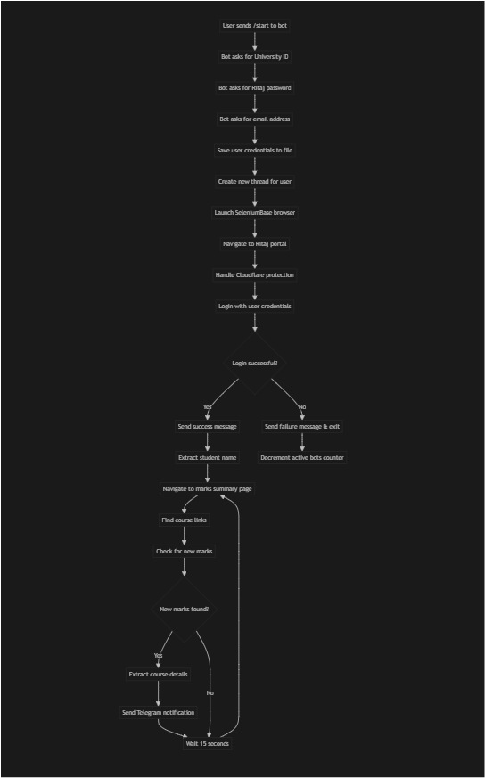

# 🎓 Ritaj Marks Scraper

A **Telegram bot** that automatically monitors and notifies Birzeit University students when new marks are posted on the Ritaj portal. This bot eliminates the need for manual checking by continuously scraping the student portal and sending real-time notifications directly to your Telegram chat.

## ✨ Features

- **🔔 Real-time Notifications**: Get instant alerts when new marks are posted
- **🔐 Secure Login**: Handles Cloudflare protection and secure authentication
- **👥 Multi-user Support**: Each student gets their own monitoring thread
- **📊 Detailed Reports**: Shows course symbol, name, your mark, and class average
- **⚡ Fast Monitoring**: Checks for new marks every 15 seconds
- **🛡️ Session Management**: Automatically handles login timeouts and re-authentication
- **👨‍💼 Admin Features**: Built-in admin commands to monitor bot usage

## 🎯 How It Works

The bot operates by creating individual monitoring threads for each user that:

1. **Authenticate** with Ritaj using your credentials
2. **Navigate** to the marks summary page
3. **Extract** course links and mark information
4. **Compare** with previously found marks
5. **Notify** you via Telegram when new marks appear
6. **Repeat** the process every 15 seconds

## 🔄 System Flow



### 🔄 Execution Flow

1. **User Registration**: Bot collects and validates user credentials
2. **Thread Creation**: Each user gets a dedicated monitoring thread
3. **Browser Launch**: SeleniumBase opens Chrome in undetected mode
4. **Authentication**: Login to Ritaj with Cloudflare protection handling
5. **Monitoring Loop**: 
   - Navigate to marks page
   - Extract course links
   - Check for new marks
   - Send notifications for new discoveries
   - Wait 15 seconds before repeating
6. **Error Handling**: Automatic re-authentication and error recovery


## 📋 Prerequisites

Before setting up the bot, ensure you have:

- **Python 3.7+** installed on your system
- **Chrome browser** (required for SeleniumBase)
- **Telegram account** for creating and using the bot
- **Birzeit University credentials** (student ID and Ritaj password)

## 🚀 Setup Instructions

### Step 1: Create a Telegram Bot

1. **Open Telegram** and search for `@BotFather`
2. **Start a conversation** with BotFather
3. **Send** `/newbot` command
4. **Follow the prompts** to:
   - Choose a name for your bot (e.g., "My Ritaj Scraper")
   - Choose a username (must end with 'bot', e.g., "my_ritaj_scraper_bot")
5. **Copy the bot token** that BotFather provides

> 📖 **Detailed Guide**: For complete step-by-step instructions with screenshots, visit the [official Telegram bot creation tutorial](https://core.telegram.org/bots/tutorial).

### Step 2: Clone and Setup the Project

```bash
# Clone the repository
git clone https://github.com/obada-jaras/Ritaj-Marks-Scraper.git
cd Ritaj-Marks-Scraper

# Install dependencies
pip install -r requirements.txt
```

### Step 3: Configure the Bot

1. **Open** `utils/config.py`
2. **Replace** `'api token here'` with your actual bot token:
   ```python
   TELEGRAM_API_TOKEN = 'YOUR_BOT_TOKEN_HERE'
   ```

### Step 4: Run the Bot

```bash
python telegramHandler_V2.py
```

### Step 5: Interact with Your Bot

1. **Find your bot** on Telegram using the username you created
2. **Send** `/start` to begin the setup process
3. **Provide** your university ID when prompted
4. **Enter** your Ritaj password
5. **Add** your email address
6. **Wait** for the "Bot started!" message

The bot will now continuously monitor your marks and send notifications when new ones appear!

## 🏗️ Technical Architecture

### 📁 Project Structure

```
Ritaj-Marks-Scraper/
├── 📄 main.py                 # Core scraping engine
├── 📄 telegramHandler_V2.py   # Main bot interface (Entry Point)
├── 📄 course.py               # Course data model
├── 📄 requirements.txt        # Python dependencies
├── 📄 users/info/            # User credentials storage
└── 📄 utils/
    ├── config.py             # Configuration settings
    └── validators.py         # Input validation functions
```

### 🔧 Core Components

#### **telegramHandler_V2.py** (Entry Point)
- **Purpose**: Main Telegram bot interface
- **Key Functions**:
  - `start()`: Initializes user registration flow
  - `ask_for_id()`, `ask_for_password()`, `ask_for_email()`: Collects user credentials
  - `starting_bot()`: Launches monitoring thread for user
  - `handle_message()`: Processes incoming messages based on conversation state
  - `numberOfUsers()`: Admin command to check bot statistics

#### **main.py** (Scraping Engine)
- **Purpose**: Web scraping and monitoring logic
- **Key Functions**:
  - `run_bot()`: Main monitoring loop for each user
  - `login()`: Handles Ritaj authentication with Cloudflare bypass
  - `get_available_marks_links()`: Discovers course mark links
  - `get_course_mark()`: Extracts detailed mark information
  - `send_telegram_message()`: Sends notifications to users
  - `is_logged_in()`: Checks authentication status

#### **course.py** (Data Model)
- **Purpose**: Represents course mark information
- **Properties**:
  - `url`: Link to the course marks page
  - `symbol`: Course code (e.g., "COMP233")
  - `name`: Full course name
  - `mark`: Student's mark
  - `average`: Class average (if available)
  - `checked`: Flag to prevent duplicate notifications

#### **utils/config.py** (Configuration)
- **Purpose**: Centralized configuration management
- **Contains**: Telegram bot token and other settings

#### **utils/validators.py** (Validation)
- **Purpose**: Input validation utilities
- **Functions**:
  - `is_valid_user_id()`: Validates student ID format
  - `is_valid_email()`: Validates email addresses using regex

### 🛠️ Dependencies

- **`seleniumbase`**: Web automation and scraping
- **`python-telegram-bot==13.7`**: Telegram bot framework
- **`contextlib`**: Context management utilities
- **`threading`**: Multi-threading support
- **`re`**: Regular expressions for validation

## 🚨 Important Notes

### Security Considerations
- **Credentials are stored in plain text** - Consider encrypting sensitive data
- **Bot token should be kept secure** - Never share it publicly
- **User data is stored locally** - Ensure proper file permissions

### Limitations
- **Cloudflare dependency**: Changes to Ritaj's protection might break login
- **Shared global state**: `available_marks_courses` is shared across threads
- **No database**: Uses simple text files for data persistence
- **Fixed admin ID**: Admin functionality is tied to a specific chat ID

## 🎯 Possible Enhancements

We welcome contributions! Here are some improvement ideas:

### 🔒 Security Improvements
- [ ] **Encrypt stored passwords** using libraries like `cryptography`
- [ ] **Add environment variable support** for sensitive configuration
- [ ] **Implement proper user authentication** with session tokens

### 🗄️ Database Integration
- [ ] **Replace text files with SQLite/PostgreSQL** for better data management
- [ ] **Add user preferences** (notification frequency, specific courses)
- [ ] **Implement data backup and recovery** mechanisms
- [ ] **Add audit logging** for security monitoring

### 🎨 User Experience
- [ ] **Add course filtering** options (only specific courses)
- [ ] **Implement notification scheduling** (quiet hours)
- [ ] **Add mark history** and statistics
- [ ] **Create a web dashboard** for advanced users

### 🔧 Technical Improvements
- [ ] **Add comprehensive error handling** with retry mechanisms
- [ ] **Implement graceful shutdown** procedures
- [ ] **Add unit and integration tests**
- [ ] **Create Docker containerization** for easy deployment
- [ ] **Add monitoring and alerting** for bot health

## 🤝 Contributing

We love contributions from the community! Here's how you can help:

### 🚀 Getting Started

1. **Fork the repository** on GitHub
2. **Clone your fork** locally:
   ```bash
   git clone https://github.com/yourusername/Ritaj-Marks-Scraper.git
   ```
3. **Create a new branch** for your feature:
   ```bash
   git checkout -b feature/your-feature-name
   ```
4. **Make your changes** following our coding standards
5. **Test thoroughly** with different scenarios
6. **Commit your changes** with clear messages:
   ```bash
   git commit -m "Add: Brief description of your changes"
   ```
7. **Push to your fork** and create a pull request

### 🎯 Coding Standards

- **Follow PEP 8** Python style guidelines
- **Write clear, self-documenting code**
- **Add comments** for complex logic
- **Use meaningful variable and function names**
- **Keep functions small and focused** (Single Responsibility Principle)
- **Handle errors gracefully** with proper exception handling

### 🧪 Testing

- **Test with different user scenarios**
- **Verify Cloudflare protection handling**
- **Check error recovery mechanisms**
- **Ensure thread safety** for concurrent users

### 📝 Documentation

- **Update README.md** if you add new features
- **Document new configuration options**
- **Add inline comments** for complex algorithms
- **Update requirements.txt** if you add dependencies

### 🐛 Bug Reports

When reporting bugs, please include:
- **Python version** and operating system
- **Complete error messages** and stack traces
- **Steps to reproduce** the issue
- **Expected vs actual behavior**
- **Relevant configuration** (without sensitive data)

### 💡 Feature Requests

- **Describe the use case** and problem you're solving
- **Explain the proposed solution** in detail
- **Consider backward compatibility**
- **Discuss potential implementation approaches**

## 🔧 Troubleshooting

### Common Issues

#### Bot Not Responding
- **Check bot token** in `utils/config.py`
- **Verify bot is running** without errors
- **Ensure user sent** `/start` command first

#### Login Failures
- **Verify credentials** are correct
- **Check Ritaj portal** accessibility
- **Update Chrome browser** to latest version
- **Clear browser cache** and cookies

#### Missing Notifications
- **Check bot permissions** in Telegram
- **Verify marks page** structure hasn't changed
- **Look for error messages** in console output
- **Restart the bot** if session expired

#### Performance Issues
- **Monitor system resources** (CPU, memory)
- **Check network connectivity**
- **Reduce check frequency** if needed
- **Limit number of concurrent users**

### Debug Mode

Enable debug logging by modifying the logging configuration:

```python
import logging
logging.basicConfig(level=logging.DEBUG)
```

### Getting Help

- **Check existing issues** on GitHub
- **Search documentation** for similar problems
- **Create a new issue** with detailed information
- **Join community discussions** for support

## 📄 License

This project is licensed under the MIT License - see the [LICENSE](LICENSE) file for details.

## 📜 Disclaimer

This README.md file was written using **Cursor (Claude-4-Sonnet)** with careful attention from the project owner to ensure comprehensive coverage of all project aspects, setup instructions, technical details, and contribution guidelines. The content has been reviewed and approved to accurately represent the project's functionality and requirements.

---

**⭐ If this project helped you, please consider giving it a star on GitHub!**

**📧 Questions? Feel free to open an issue or reach out to the maintainers.**

**🎓 Happy studying, Birzeit University students!** 